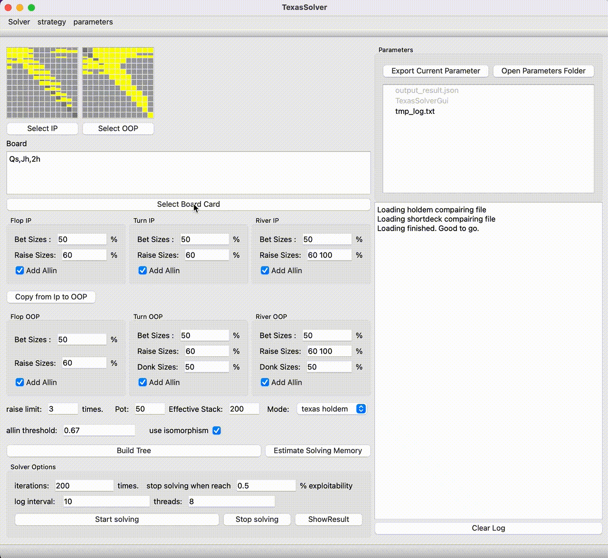

# Hold'em Solver

[English](README.md) | [中文](README.zh-CN.md)

## Introduction

Open source Texas Hold'em and short deck solver.

### Features

- In a tree with 1~2 bets + allin, it's speed exceeds piosolver on flop
- Support Mac OS, Linux and Windows
- Support Texas Hold'em and Short Deck
- Result aliged with PioSolver
- Support export a strategy to a JSON file

Feel free to mess with a toy solver [in google colab](https://colab.research.google.com/github/bupticybee/TexasSolver/blob/console/TexasSolverTechDemo.ipynb)

## GUI version Usage

After install the solver, double click the application binary (TexasSolverGui.exe in windows or TexasSolverGui.app in MacOS) to run TexasSolver.

## Console version Usage

Please check [console version document](https://github.com/bupticybee/TexasSolver/tree/console#usage) for more.

## Speed benchmark with piosolver

Piosolver and my TexasSolver(console version) run use the same settings (spr=10, flop game) and their result are aligned.

|                                | Input config                                              | log                                                          | thread number | memory usage | accuracy | converge time |
| ------------------------------ | --------------------------------------------------------- | ------------------------------------------------------------ | ------------- | ------------ | -------- | ------------- |
| piosolver 1.0                  | [config_piosolver](benchmark/benchmark_piosolver.txt)     | [log_piosolver](benchmark/benchmark_outputs/piosolver_log.txt) | 6             | 492Mb        | 0.29%    | 242s          |
| TexasSolver 0.1.0              | [config_texassolver](benchmark/benchmark_texassolver.txt) | [log_texassolver](benchmark/benchmark_outputs/texassolver_log.txt) | 6             | 1600Mb       | 0.275%   | 172s          |

The compare image of their results is  [here](benchmark/benchmark_outputs/result_compair.png). As you can see their result are very close.

## License

[GNU AGPL v3](https://www.gnu.org/licenses/agpl-3.0.en.html)

> Original Author's Email: icybee@yeah.net

## Q & A

1. Q: Is the solver really free?
   - A: Yes, for personal users, the solver is completely opensourced and free.

2. Q: Can I upload it to other websites or forums? Can I share it with my friend?
   - A: No, you can only put the link of this project to other website, not the binary, this project is under AGPL-V3 license, and these kind of actions violates this license.

3. Q: Can I integrate it to my software?
   - A: If you integrate the release package (binary) into your software, Yes, you can do that. If you want to integrate the code of the solver into your software or provide service through internet, then you need to contact me for a commercial license, which is also the main profit-making method of this project.

4. Q: What framework do you use to write the ui?
   - A: QT 6.2.1, Mingw & CMake.

## Game Theory Optimal (GTO) Texas Hold'em Poker Theory

Game Theory Optimal (GTO) poker is “an umbrella term players use to describe the holy grail of no-limit holdem playing strategy” (MasterClass). In general, the optimal theory dictates that the player is always making the decision that returns the most profit in the long run. For example, when the player is faced with the decision of check/call, bet, or fold at the start of every hand, there are different hand combinations (A,A , K,K , A,K , etc.) which each have an associated win percentage. With the following GTO, the player will have a range, a number of the different hand combinations that they will call or raise with. Any hand not within their range, they will fold. But GTO does not mean one should always follow the statistics. In a heads-up game, with only two players, one should win more often than not strictly following the statistics, but in reality this rarely happens.

When playing against a human, one must factor in a certain amount of randomness and consider the various strategies they could be using. “You have some idea of what the strategy would be with various hands, and your job is to take that into account when executing your own strategy. In other words, play the player. This is what GTO poker is all about” (Yakovenko). But “as you adjust your strategy to an opponent’s strategy, he or she will adjust to yours, and so forth” (Yakovenko). This creates an endless cycle of readjusting your strategy to counter your opponent’s strategy. In games with more than two players, it is near impossible to find an optimal strategy for every situation. In a heads-up, two player game, it is possible to find a GTO equilibrium where “an opponent cannot exploit – or atleast cannot exploit beyond a 1% edge – with any other possible strategy” (Yakovenko). “A group of scientists from The University of Alberta… [declared they] found a way to ‘solve’ the game” (Angioni) in 2015 when they found one possible GTO equilibrium for heads-up limit Texas holdem.

They used 200 computers and had a program play “uniform games against itself” for 70 days in order to train, learning “every possible move in the game” (Angioni), stopping when they “can’t tell it apart from being perfect” (Angioni). One of their major conclusions, other than finding AI that can perform GTO poker consistently, was that the researchers “can now prove that the dealer has an advantage of what we call ‘88 millablinds’ per game, or .088 of a big blind per game” (Angioni). While that discovery in itself is significant, it is also important to consider that now other questions about poker theory that require an environment with an AI that can play perfectly can be explored.

GTO poker theory relates to the game theory portion of class. Each individual at the tables has a series of decisions to make, based on a set number of cards, variables. Their odds of winning, which could also be see as profit like in some of the class examples, are affected by the decisions of themselves, and others at the tables. Poker is also similar to the auction theory we discussed in class, specifically a first-price auction, as each player is putting in a bid each round, at the value they assigned to their current hand, for the overall pot.

Poker Range (of possible 2-card hands)

## Citations

- [Yakovenko, Nikolai. “Game Theory Optimal Solutions and Poker: A Few Thoughts on GTO Poker.” PokerNews, PokerNews, 8 May 2020](https://www.pokernews.com/strategy/game-theory-optimal-solutions-and-poker-a-few-thoughts-22654.htm#:~:text=GTO%20)

- [Angioni, Giovanni. “Five Scientists Claim They Have Solved Heads-Up Limit Texas Hold’em.” PokerNews, PokerNews, 10 Jan. 2015](https://www.pokernews.com/news/2015/01/five-scientists-claim-they-have-solved-poker-20261.htm)

- [MasterClass Staff. “Learn About Poker: What Is GTO (Game Theory Optimal)? – 2021.” MasterClass, MasterClass, 3 Sept. 2021](https://www.masterclass.com/articles/learn-about-poker-what-is-gto-game-theory-optimal#what-is-gto-poker)

